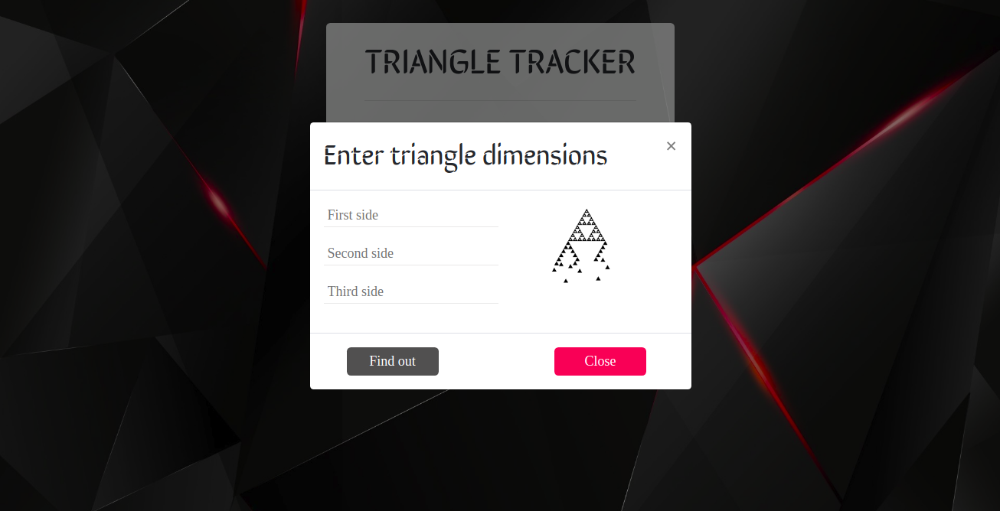

# TRIANGLE TRACKER
#### Screenshot

View and get your triangle type by feeding dimensions [here](https://macymuhia.github.io/Triangle-Tracker/)

Last modified 2nd June 2019.
#### By **Mercy Muhia**
## Description
Triangle Tracker takes in three dimensions and tells the user the name of the type of triangle formed by the dimensions the user inputs.
## Specification
* For an equilateral triangle, all sides must be equal.
* For an isosceles triangle, two sides are exactly equal.
* For a scalene triangle, none of the sides is equal. However, the sum of any two sides of the triangle must be greater than the third side.
* Most importantly, if the sum of any two sides of the triangle is equal to or less than the third remaining side, then a triangle CANNOT be formed using those values. (For example, the values 9,4 & 3 cannot form a triangle.)
## Sample behaviour

  Behaviour | Input example | Output example
--- | --- | ---
Equilateral Triangle | 5, 5, 5 | You have an equilateral triangle
Isosceles Triangle | 5, 5, 3 | You have an isosceles triangle
Scalene Triangle | 4, 5, 3 | You have a scalene triangle
No Triangle | 5, 5, 50 | Those dimensions cannot form a triangle
Missing dimensions | 5, 5 | Kindly input three dimensions

 
## Setup/Installation Requirements
* Git clone https://github.com/macymuhia/Triangle-Tracker.git
* cd Triangle-Tracker
* open index.html file on your preferred browser
## Technologies Used
HTML, CSS and Javascipt
### License
*MIT*

### &copy; 2019